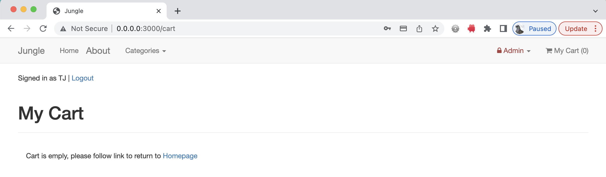

# Jungle

A mini e-commerce application built with Rails 4.2 for purposes of teaching Rails by example.

## Setup

1. Run `bundle install` to install dependencies
2. Create `config/database.yml` by copying `config/database.example.yml`
3. Create `config/secrets.yml` by copying `config/secrets.example.yml`
4. Run `bin/rake db:reset` to create, load and seed db
5. Create .env file based on .env.example
6. Sign up for a Stripe account
7. Put Stripe (test) keys into appropriate .env vars
8. Run `bin/rails s -b 0.0.0.0` to start the server

---

## Testing

1. Install the new dependency for your project: `bundle # aka bundle install`
2. Run Rspec one-time generator: `bin/rails generate rspec:install`
3. Generate the binstub so you can run bin/rspec instead of bundle exec rspec from within the project directory: `bundle binstubs rspec-core`
4. generate a new model `bin/rails g model [model name]` to create new \_spec files
5. Run the migration to create the new table `bin/rake db:migrate`
6. Run the specs again to see this newly generated model spec run `bin/rspec`

---

Stripe Testing

Use Credit Card # 4111 1111 1111 1111 for testing success scenarios.

More information in their docs: https://stripe.com/docs/testing#cards

---

## Dependencies

- Rails 4.2 [Rails Guide](http://guides.rubyonrails.org/v4.2/)
- PostgreSQL 9.x
- Stripe
- BCrypt

---

## Images

1. Login Signup
   
2. Sold Out Badge
   
3. New Product Page
   
4. New Category
   
5. empty_cart
   
6. pay_in_cart_w_Stripe
   
7. Continue Shopping
   
